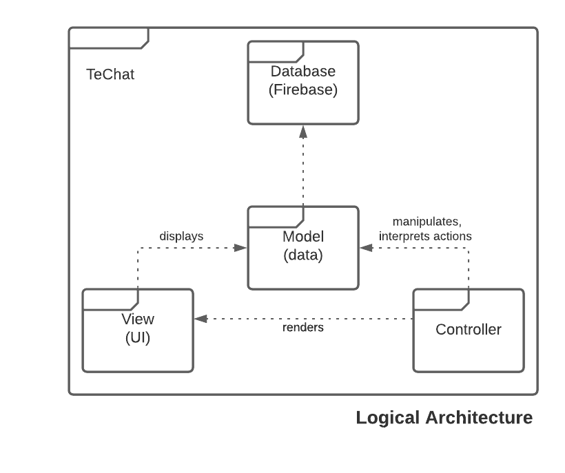
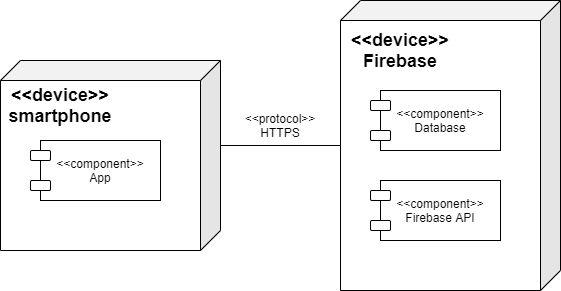

# openCX- TeChat Development Report

Welcome to the documentation pages of the TeChat of **openCX**!

You can find here detailed about the TeChat product, hereby mentioned as module, from a high-level vision to low-level implementation decisions, a kind of Software Development Report (see [template](https://github.com/softeng-feup/open-cx/blob/master/docs/templates/Development-Report.md)), organized by discipline (as of RUP):

* Business modeling
  * [Product Vision](#Product-Vision)
  * [Elevator Pitch](#Elevator-Pitch)
* Requirements
  * [Use Case Diagram](#Use-case-diagram)
  * [User stories](#User-stories)
  * [Domain model](#Domain-model)
* Architecture and Design
  * [Logical architecture](#Logical-architecture)
  * [Physical architecture](#Physical-architecture)
  * [Prototype](#Prototype)
* [Implementation](#Implementation)
* [Test](#Test)
* [Configuration and change management](#Configuration-and-change-management)
* [Project management](#Project-management)

So far, contributions are exclusively made by the initial team, but we hope to open them to the community, in all areas and topics: requirements, technologies, development, experimentation, testing, etc.

Please contact us!

Thank you!

- Alexandra Ferreira
- Marta Santos 
- Raquel Sepúlveda
- Rita Silva


---

## Product Vision

At online conferences, meaningful connections and direct conversations
are lost. Thus, to enhance net-working, TE**CHat** is a virtual space in form
of a map, allowing users to walk in and out of conversations as naturally
as in real life - where interactions are solemnly based on one's interest.

Making the breaks between sessions more fun and opening up possibilities
for new connections.


## Elevator Pitch

The presence of technology in our lifes has increased exponentially; as a result, mobile communications have become the number one way of contacting people. TE**CHat** is a mobile application that lets you chat with other people during online conference's 'virtual coffee breaks'. We combine chatrooms with a 2D map, letting you walk around and choose which theme you want to discuss. Our creation tools also let you create your own themed chatroom! Sharing knowledge, learning new things and interact online have never been so fun!  
TE**CHat** unlocks the constrains of being behind a screen and creates the possibility of making new connections, just as naturally as if you were there in person. 


## Requirements

### Use case diagram


+ **Home Page Navigation**  

**Actor**: Attendee  
**Description**: This use case exists so that, at online conferences or during a break, the attendee can use the application.  
**Preconditions and Postconditions**: In order to navigate the home page, the attendee must be logged in to his account. If he doesn't have an account yet, he can create one. Afterwards, the user will have full access to the application's functionalities.   

**Normal Flow**:    
  a. The attendee signs in.  
  b. The application validates email/password.   
  c. Reaches Home Page.
  <br>OR<br/>
  a. The attendee creates an account.  
  b. The application asks for personal information such as the email and password.  
  c. Reaches Home Page.

**Alternative Flows and Exceptions**:  
  a. The user types his personal information.
  b. The application doesn't recognize the email/password.  
  c. The application emits error message.   

+ **Enter Chatroom**  

**Actor**: Attendee   
**Description**: The attendee is directed to a chatroom.  
**Preconditions and Postconditions**: In order to enter a chatroom, the attendee must choose on of the points in the map. A pop-up message containing the chat's main information will appear - the user can then choose whether he wants to join the chat or continue on the home page. Once he joins a chatroom, he'll be able to text the other chatroom participants and leave the chatroom whenever he wants.  

**Normal Flow**:    
  a. The attendee has chosen the discussion topic he wants to join.  
  b. A pop up box appears, displaying the chat's information.   
  c. The attendee decides to join in and is directed to the chosen chatroom.  
  d. The attendee is able to text, leave the chatroom, save someone's contact.
  <br>OR<br/>
  a. The attendee has chosen the discussion topic he wants to join.  
  b. A pop up box appears, displaying the chat's information.  
  c. The attendee decides to not join and is directed to the home page.  
  d. The attendee is able to text, leave the chatroom, save someone's contact.
  
**Alternative Flows and Exceptions**:  
  a. The user is the chatroom creator.
  b. The user can ban or mute other participants, in need. 
  <br>OR<br/>
  c. The user is the chatroom creator. 
  d. As long as there are people still participating in the chatroom, the moderator can't delete the chatroom.    

+ **Networking**  

**Actor**: Attendee   
**Description**: The attendee can get a list of users that share interests with him.   
**Preconditions and Postconditions**: If the attendee hasn't added any interests to his profile, no suggested similar users will be shown. Once the app has found at least one user sharing at least one interest with the attendee, this user's information and shared interest will be displayed on this page.  

**Normal Flow**:    
  a. The attendee clicks on the 'networking' button.  
  b. A list of users with similar interests is shown. 
  <br>OR<br/>
  a. The attendee clicks on the 'networking' button.  
  b. The attendee doesn't have any matches [no one shares his interests or he has no interests saved].  
  c. A message suggests he add more interests.

+ **Create Chatroom**  

**Actor**: Attendee Chatroom Moderator  
**Description**: The attendee has the option to create a new discussion topic.   
**Preconditions and Postconditions**: In order to create a new chatroom, the attendee must click the 'create new topic' button and type its name. In the end, the user can text the other chatroom participants, leave the chatroom, save information about other users, mute/ban other participants, delete the chatroom.  

**Normal Flow**:  
  a. The attendee clicks the button 'create new topic'.
  b. The attendee types the chatroom's name.
  c. The attendee is able to text, leave the chatroom, save someone's contact, ban/mute other participants, delete the chatroom.

### User stories

**[Project Board with Progress on User Stories](https://github.com/FEUP-ESOF-2020-21/open-cx-t5g4-techgals/projects/1)**

[Completed User Stories](https://github.com/FEUP-ESOF-2020-21/open-cx-t5g4-techgals/issues?q=is%3Aissue+is%3Aclosed+label%3A%22User+Story%22)

**User Story Overview**  


### Domain model

The main entities created for our app were the following:


In the navigation map, we have access to the several chatrooms created. Every user may choose to enter one chatroom at a time. Messages sent to a chatroom are stored for everyone who might come to enter said chatroom to see, and are always associated to the user who sent them.


## Architecture and Design

### Logical architecture

  

The structure of our project is based on the MVC model. In short, the MVC specifies that the application consists of a **Model** that directly manages the data, the **View** is the display of the information, and the **Controller** is where the inputs are accepted and converted into commands.  


### Physical architecture


We chose flutter as our framework to develop our project.  
As it is easy to integrate with flutter, we chose Firebase for database management and backend server.  
Our physical architecture isn't complex. The users install the application on their smartphones and it communicates with the firebase server via https requests, which is where the data is stored.  

### Prototype
We approach our project from a bottom up approach, we started by developing a simple Map Interface Application.
Then as the project moved along the website started to grow in features to accomodate the new user-stories. The ability to join groupchats and send messages was implemented.
When more data was added to the application's database, the ability to network by connecting the user to other similar-minded attendees was added.
Lastly, a space to create new groupchats was implemented, to make sure the users could enjoy the app to the fullest. With this came the definition of a chatroom moderator, someone who can mute / expel users when need be.

## Test
To test our application we have decided to add Unit Tests and Automated Acceptance Tests using gherkin.

Acceptance tests are a formal description of the behavior of a software product, generally expressed as an example or a usage scenario. We implemented them using Gherkin language, with the aid of flutter_gherkin package for Flutter and expressing some of the scenarios.

Unit Tests are a way of testing a unit (the smallest piece of code that can be logically isolated in a system) and we implemented them using the flutter_test dependency.

- Acceptance Tests:
   1. login
    ```
    Scenario: Login into app successfully
    Given I am at the 'welcomepage'
    When I tap 'login'
      And I type 'email'
      And I type 'password'
      And I tap 'loginbtn'
    Then I should be successfully logged
    ```
   2. signup
    ```
    Scenario: Signup into app successfully
    Given I am at the 'welcomepage'
    When I tap 'signup'
      And I type 'username'
      And I type 'email'
      And I type 'password'
      And I tap 'signupbtn'
    Then I should be successfully signed up
    ```
- Unit Tests:
 
 Presence of certain widgets to verify the construction of certain class.

---
## Configuration and change management

Configuration and change management are key activities to control change to, and maintain the integrity of, a project’s artifacts (code, models, documents).

For the purpose of ESOF, we will use a very simple approach, just to manage feature requests, bug fixes, and improvements, using GitHub issues and following the [GitHub flow](https://guides.github.com/introduction/flow/).

---

## Project management

To manage the progress of this project, we are using [Github Projects](https://github.com/FEUP-ESOF-2020-21/open-cx-t5g4-techgals/projects/1).
