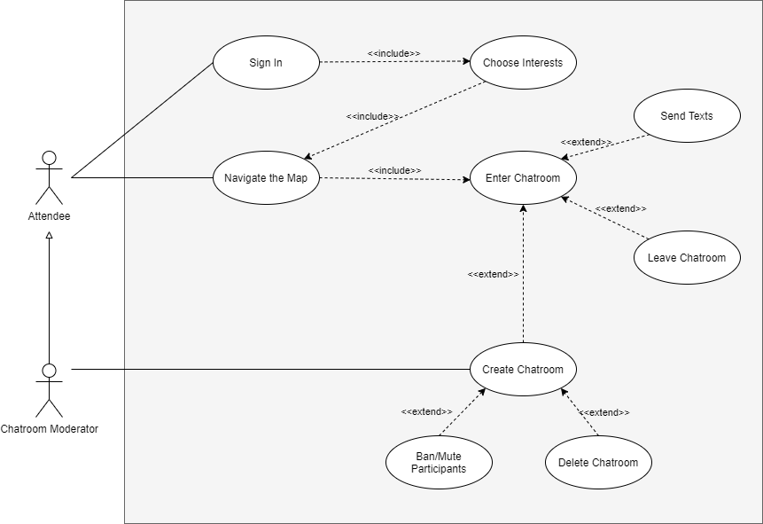
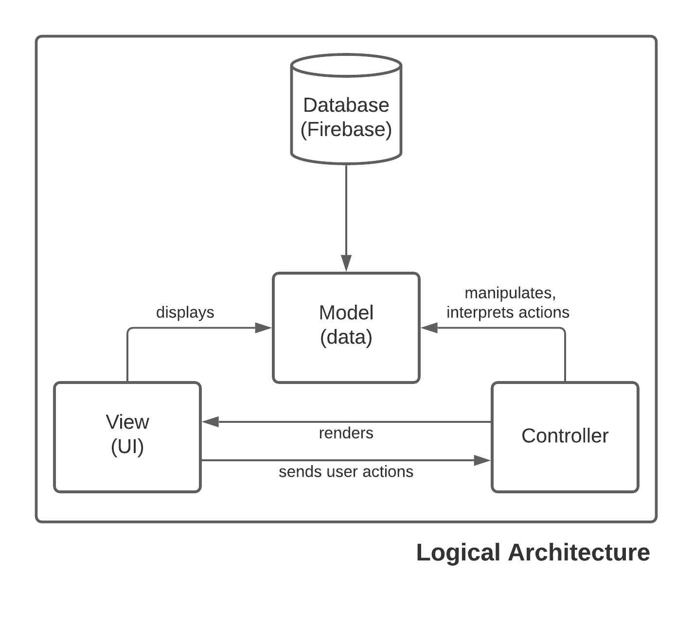
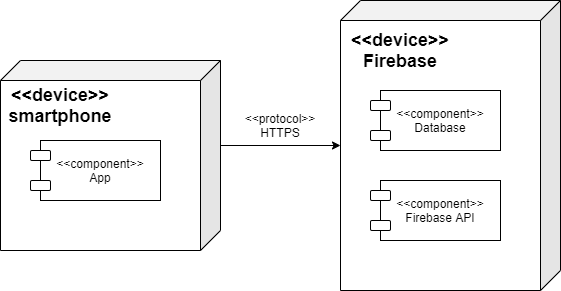

# openCX-*your module name* Development Report

Welcome to the documentation pages of the *your (sub)product name* of **openCX**!

You can find here detailed about the (sub)product, hereby mentioned as module, from a high-level vision to low-level implementation decisions, a kind of Software Development Report (see [template](https://github.com/softeng-feup/open-cx/blob/master/docs/templates/Development-Report.md)), organized by discipline (as of RUP):

* Business modeling
  * [Product Vision](#Product-Vision)
  * [Elevator Pitch](#Elevator-Pitch)
* Requirements
  * [Use Case Diagram](#Use-case-diagram)
  * [User stories](#User-stories)
  * [Domain model](#Domain-model)
* Architecture and Design
  * [Logical architecture](#Logical-architecture)
  * [Physical architecture](#Physical-architecture)
  * [Prototype](#Prototype)
* [Implementation](#Implementation)
* [Test](#Test)
* [Configuration and change management](#Configuration-and-change-management)
* [Project management](#Project-management)

So far, contributions are exclusively made by the initial team, but we hope to open them to the community, in all areas and topics: requirements, technologies, development, experimentation, testing, etc.

Please contact us!

Thank you!

- Alexandra Ferreira
- Marta Santos 
- Raquel Sepúlveda
- Rita Silva


---

## Product Vision

At online conferences, meaningful connections and direct conversations
are lost. Thus, to enhance net-working, we built a virtual space in form
of a map, allowing users to walk in and out of conversations as naturally
as in real life - where interactions are solemnly based on one's interest.

Making the breaks between sessions more fun and opening up possibilities
for new connections.


## Elevator Pitch

This is a mobile app that allows online conferences attendees
to interact with each other through chatrooms. This gives them a better
experience, keeping direct interactions alive.


## Requirements

The application should give the user the opportunity to choose his interests so that the map shows appealing topics. Hence the exhibited topics should lead to chatrooms where the users can communicate. It should be possible to leave the chatrooms. A user can create a new topic, giving him responsability for its chatroom management.

### Use case diagram



- **Navigate the Map**
> **Actor**: Attendee  
> **Description**: The application directs the attendee to a personalized map view, showing points of interest in the form of discussion topics related to his interests.  
> **Preconditions**: Attendee has logged in / signed up successfully.  
> **Postconditions**: Attendee can choose whether he wants to join a chatroom (and which one) or whether he wants to access his personal space and exit the app.   

> **Normal Flow**:
  1. The application shows a map, containing different active chatrooms.
  2. The attendee is able to choose which chatroom to join.
  3. The App bar contains the person icon, through which the user can access his personal space.

> **Alternative Flows and Exceptions**: The user doesn't find any themes interesting -> The user can refresh the map. The user doesn't find a topic he really wanted to discuss -> He can create a new chatroom. 

- **Chatroom**
> **Actor**: Attendee  
> **Description**: The attendee enters a chatroom.  
> **Preconditions**: Attendee has chosen the topic he wants to discuss.  
> **Postconditions**: Attende can text the other chatroom participants. Attendee can leave the chatroom whenever he wants. Attendee can save information about other user.  


- **Sign In**
> **Actor**: Attendee  
> **Description**: This use case exists so that, at online conferences or during a break, the attendee can enter the application.  
> **Preconditions and Postconditions**: In order to sign in, the attendee must have an account. If not, he can create one. In the end, the user must have full access to the application   functionalities.   

> **Normal Flow**:    
  1. The attendee signs in.  
  2. The application validates email/password.  
  3. The application will ask for user's interests.   
  or  
  1. The attendee creates an account.  
  2. The application asks for personal information such as the email and password.  
  3. The application will ask for user's interests.  

> **Alternative Flows and Exceptions**: The user types his personal information -> the application doesn't recognize the email/password -> the application emits error message.   

- **Choose interests**  
> **Actor**: Attendee  
> **Description**: The application asks the user to set his interests.  
> **Preconditions and Postconditions**: In order to choose his interests, the user must first register and sign in. In the end, the user must be able to see a personalized map.  

> **Normal Flow**:
  1. The application asks the user to set his interests.  
  2. The application validates the interests entered by the attendee.  

- **Navigate the Map**
> **Actor**: Attendee  
> **Description**: The application directs the attendee to a personalized map view, showing points of interest in the form of discussion topics related to his interests.  
> **Preconditions and Postconditions**: In order to view the map, the attendee must have set his interests and personal information with success. In the end, the attendee can chose the chatrooms, represented on the map, he wants to join.  

> **Normal Flow**:
  1. The attendee has set his interests and personal information with success.
  2. The application shows a personalized map, showing discussion topics of interest.
  3. The attendee is able to choose any of the themes that lead to their respective chatroom.

> **Alternative Flows and Exceptions**: The user doesn't find a topic he really wanted to discuss -> He can create a new chatroom.  

- **Enter Chatroom**
> **Actor**: Attendee   
> **Description**: The attendee is directed to a chatroom.  
> **Preconditions and Postconditions**: In order to enter a chatroom, the attendee must choose on of the points in the map. In the end, the attendee can text the other chatroom participants, leave the chatroom or save information about other users.  


### User stories

**[Project Board with Progress on User Stories](https://github.com/FEUP-ESOF-2020-21/open-cx-t5g4-techgals/projects/1)**

[Completed User Stories](https://github.com/FEUP-ESOF-2020-21/open-cx-t5g4-techgals/issues?q=is%3Aissue+is%3Aclosed)

1. - **As an attendee, I want my account to store my interests and my contact information, so that I can have a more personalized experience.**  
**Value:** Should-Have  
**Effort:**  7  
 <dl>
  <dt> Acceptance Tests: </dt>
  <dd>Given that I'm an user logging in, if I don't have any interests associated to my account, then I should be asked if I want to add them.</dd>
  <dd>Given that I'm an user with interests stored in my profile, when I'm looking for chatrooms, then the first ones to appear should be related to my interests.</dd>
</dl>  

2. - **As an attendee, I want to create a new chatroom with a new topic, so that I can discuss a topic that doesn't already exist.**  
**Value:**  Should-Have  
**Effort:**  M  
<dl>
  <dt> Acceptance Tests: </dt>
  <dd>Given that I'm an user, when the topic I want to discuss does not have an associated chatroom,, then I should be able to create a new chatroom about this topic.</dd>
</dl>

3. - **As a chatroom moderator, I want to manage the chatroom's participants, so that, if need be, people can me muted/banished.**  
**Value:** Could-Have  
**Effort:**  9 
<dl>
  <dt> Acceptance Tests: </dt>
  <dd>Given that I'm a user, when I create a new chatroom, then I should be assigned as the chatroom's moderator.</dd>
  <dd>Given that I'm a chatroom moderator, when I feel that something or someone is being disrespected, then I should have the option to ban or mute participants.</dd>
</dl> 
 
4. - **As a participant, I want to make friends / save someone's contact info, so that I can keep in touch with other like-minded users.**  
**Value:**  Could-Have  
**Effort:**  9
<dl>
  <dt> Acceptance Tests: </dt>
  <dd>Given that I'm an user, when I click on a participant name, then I should be able to see his information. </dd>
</dl>  


### Domain model

**[User Stories Board Link](https://github.com/FEUP-ESOF-2020-21/open-cx-t5g4-techgals/projects/1)**

**User Story Overview**  


1. **As a participant I want to login my interests and my contact information, so that I can have a personalized experience.**  
**Value:** Must-Have  
**Effort:**  L  
**Acceptance Tests:**  

 ```gherkin

    Given I want to access the app
    When I input invalid data
    Then I should be warned with an error message

    Given I am prompted to login in
    When I already have my information and interests defined
    And press the "let's go!" button
    Then I should be directed to the home page

```

**User interface mockups:**


2. **As a participant I want to access a chatroom where I can talk to other users, so that I can discuss topics that interest me.**  
**Value:** Must-Have  
**Effort:**  M  
**Acceptance Tests:**  
```gherkin

   Given I want to talk to other users
   When I choose the topic I want to discuss
   Then I should be directed to its chatroom

```

3. **As a participant, I want to choose when to enter or leave a chatroom, so that I only participate in conversations that interest me.**  
**Value:** Must-Have  
**Effort:**  S  
**Acceptance Tests:**  
```gherkin

   Given I want to manage my experience
   When the option to leave a chatroom is clicked
   Then I must be directed to the map view and be able to join another chatroom

``` 

4. **As a chatroom moderator, I want to mute/banish people if need, so that the participants have a pleasant experience.**   
**Value:** Should-Have  
**Effort:**  M  
**Acceptance Tests:**  

```gherkin

   Given I created a new chatroom topic
   When I click the banish/mute button on a certain person
   Then messages from that person must not appear

``` 

**User interface mockups:**


5. **As a participant, I want to create a new chatroom with a different theme, so that I can discuss any topic I want even if it doesn't already exists.**
**Value:**  Should-Have  
**Effort:**  M  
**Acceptance Tests:**  

```gherkin

   Given the topic I want to discuss does not exist
   When I create a new topic,
   Then I should be able to discuss it when new participants join the chatroom

   Given the topic I want to discuss does not exist
   When I create a new topic
   Then I should be able to delete the chatroom only when it has no participants

```

**User interface mockups:**


6. **As a participant, I want to make friends / save someone's contact info, so that I can keep in touch with other like-minded users.**  
**Value:**  Could-Have  
**Effort:**  S  
**Acceptance Tests:**  

```gherkin

   Given I want to make new connections
   When I click on a participant's name,
   Then I should be able to see his information and copy it.

```

**User interface mockups:**


7. **As a participant, I want to navigate the homepage, so that I can choose which functionality to access.**  
**Value:**  Must-Have  
**Effort:**  M  
**Acceptance Tests:**  

```gherkin

   Given I want to explore the app
   When I navigate the homepage,
   Then I should be able to choose which functionality to access.

   Given I want to explore the app
   When I navigate the homepage,
   Then I should be able to see where the profile button and the menu button are.
   
```

8. **As a participant I want to decide which chatroom I want to enter, so that I can discuss more than 1 theme if I want to.**  
**Value:**  Must-Have  
**Effort:**  M  
**Acceptance Tests:**  

```gherkin

   Given I want to explore the app
   When I click in a chatroom,
   Then I should be able to view information about the topic and the number of people participating in the conversation. 
   
```

**User interface mockups:**


The main entities created for our app were the following:


In the navigation map, we have access to the several chatrooms created. Every user may choose to enter one chatroom at a time. Messages sent to a chatroom are stored for everyone who might come to enter said chatroom to see, and are always associated to the user who sent them.

A **user** can create an account in the application, by setting up his username, email, password and other personal information which will appear in his profile.  
The **user** must choose his interests, in order to have a personalized experience. Each **interest** may be common to many users, and it represents a theme for a **chatroom** that may already exist. If not, the **user**, as a **chatroom moderator**, can create a new theme for a **chatroom**. Once there are participants in a **chatroom**, there can exist an unlimited number of **messages**. Each **message** can be send by a single **user**, inside a single **chatroom**, and its date, time and text associated.  

#### UML  


## Architecture and Design

### Logical architecture



### Physical architecture




The structure of our project is based on the MVC model. In short, the MVC specifies that the application consists of a **Model** that directly manages the data, the **View** is the display of the information, and the **Controller** is where the inputs are accepted and converted into commands.  

### Physical architecture


We chose flutter as our framework to develop our project.  
As it is easy to integrate with flutter, we chose Firebase for database management and backend server.  
Our physical architecture isn't complex. The users install the application on their smartphones and it communicates with the firebase server via https requests, which is where the database is stored.  

### Prototype
To help on validating all the architectural, design and technological decisions made, we usually implement a vertical prototype, a thin vertical slice of the system.

In this subsection please describe in more detail which, and how, user(s) story(ies) were implemented.

---

## Implementation
Regular product increments are a good practice of product management.

While not necessary, sometimes it might be useful to explain a few aspects of the code that have the greatest potential to confuse software engineers about how it works. Since the code should speak by itself, try to keep this section as short and simple as possible.

Use cross-links to the code repository and only embed real fragments of code when strictly needed, since they tend to become outdated very soon.

---
## Test

There are several ways of documenting testing activities, and quality assurance in general, being the most common: a strategy, a plan, test case specifications, and test checklists.

In this section it is only expected to include the following:
* test plan describing the list of features to be tested and the testing methods and tools;
* test case specifications to verify the functionalities, using unit tests and acceptance tests.

A good practice is to simplify this, avoiding repetitions, and automating the testing actions as much as possible.

---
## Configuration and change management

Configuration and change management are key activities to control change to, and maintain the integrity of, a project’s artifacts (code, models, documents).

For the purpose of ESOF, we will use a very simple approach, just to manage feature requests, bug fixes, and improvements, using GitHub issues and following the [GitHub flow](https://guides.github.com/introduction/flow/).


---

## Project management

To manage the progress of this project, we are using [Github Projects](https://github.com/FEUP-ESOF-2020-21/open-cx-t5g4-techgals/projects/1).


---

## Evolution - contributions to open-cx

Describe your contribution to open-cx (iteration 5), linking to the appropriate pull requests, issues, documentation.
