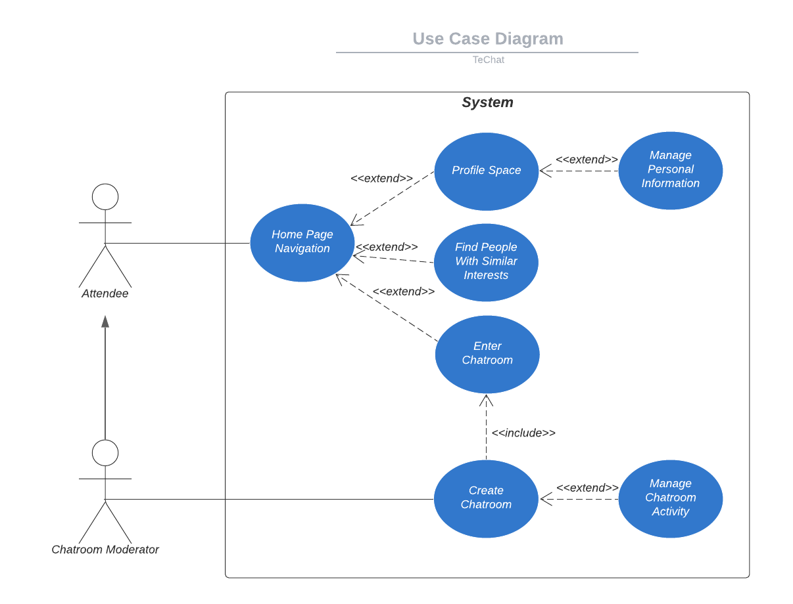
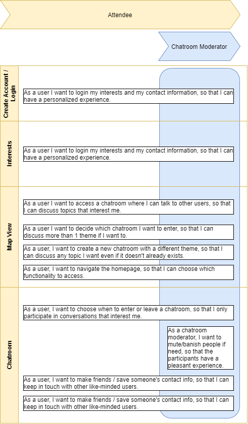
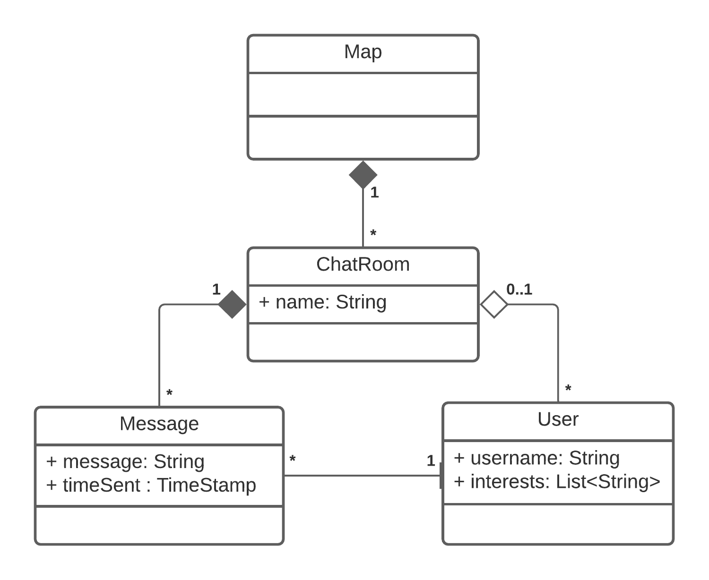
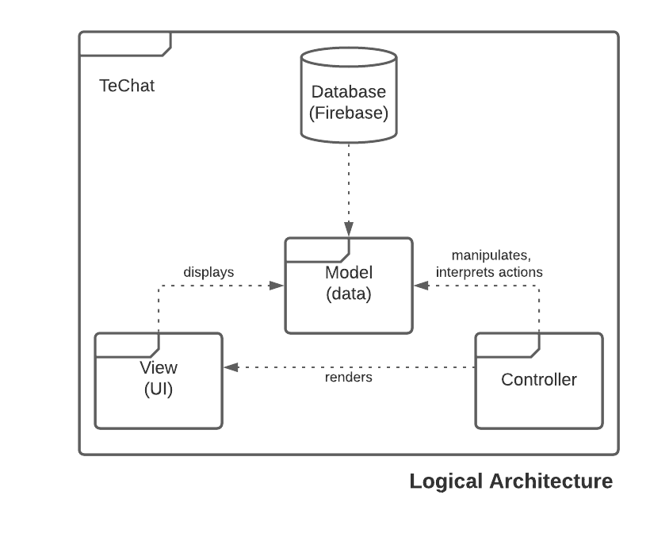
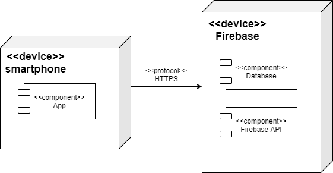

# openCX- TeChat Development Report

Welcome to the documentation pages of the TeChat of **openCX**!

You can find here detailed about the TeChat product, hereby mentioned as module, from a high-level vision to low-level implementation decisions, a kind of Software Development Report (see [template](https://github.com/softeng-feup/open-cx/blob/master/docs/templates/Development-Report.md)), organized by discipline (as of RUP):

* Business modeling
  * [Product Vision](#Product-Vision)
  * [Elevator Pitch](#Elevator-Pitch)
* Requirements
  * [Use Case Diagram](#Use-case-diagram)
  * [User stories](#User-stories)
  * [Domain model](#Domain-model)
* Architecture and Design
  * [Logical architecture](#Logical-architecture)
  * [Physical architecture](#Physical-architecture)
  * [Prototype](#Prototype)
* [Implementation](#Implementation)
* [Test](#Test)
* [Configuration and change management](#Configuration-and-change-management)
* [Project management](#Project-management)

So far, contributions are exclusively made by the initial team, but we hope to open them to the community, in all areas and topics: requirements, technologies, development, experimentation, testing, etc.

Please contact us!

Thank you!

- Alexandra Ferreira
- Marta Santos 
- Raquel Sepúlveda
- Rita Silva

---

## Product Vision

At online conferences, meaningful connections and direct conversations
are lost. Thus, to enhance net-working, TE**CHat** is a virtual space in form
of a map, allowing users to walk in and out of conversations as naturally
as in real life - where interactions are solemnly based on one's interest.

Making the breaks between sessions more fun and opening up possibilities
for new connections.

## Elevator Pitch

With the rising of technology in our lifes, texting has become the number one way of communicating. TE**CHat** is a mobile application that lets you chat with other people during online conference's 'virtual coffee breaks'. We combine chatrooms with a 2D map, letting you walk around and choose which theme you want to discuss. Our creation tools also let you create your own themed chatroom! Sharing knowledge, learning new things and interact online have never been so fun!  
TE**CHat** unlocks the constrains of being behind a screen and creates the possibility of making new connections, just as naturally as if you were there in person! 

## Requirements

### Use case diagram

- **Home Page Navigation**
> **Actor**: Attendee  
> **Description**: This use case exists so that, at online conferences or during a break, the attendee can use the application.  
> **Preconditions and Postconditions**: In order to navigate the home page, the attendee must be logged in to his account. If he doesn't have an account yet, he can create one. Afterwards, the user will have full access to the application's functionalities.   

> **Normal Flow**:    
  a. The attendee signs in.  
  b. The application validates email/password.   
  c. Reaches Home Page.
   OR 
  a. The attendee creates an account.  
  b. The application asks for personal information such as the email and password.  
  c. Reaches Home Page.

> **Alternative Flows and Exceptions**: The user types his personal information -> the application doesn't recognize the email/password -> the application emits error message.   

- **Enter Chatroom**
> **Actor**: Attendee   
> **Description**: The attendee is directed to a chatroom.  
> **Preconditions and Postconditions**: In order to enter a chatroom, the attendee must choose on of the points in the map. A pop-up message containing the chat's main information will appear - the user can then choose whether he wants to join the chat or continue on the home page. Once he joins a chatroom, he'll be able to text the other chatroom participants and leave the chatroom whenever he wants.  

> **Normal Flow**:    
  a. The attendee has chosen the discussion topic he wants to join.  
  b. A pop up box appears, displaying the chat's information.   
  c. The attendee decides to join in and is directed to the chosen chatroom.  
  d. The attendee is able to text, leave the chatroom, save someone's contact.
   OR 
  a. The attendee has chosen the discussion topic he wants to join.  
  b. A pop up box appears, displaying the chat's information.  
  c. The attendee decides to not join and is directed to the home page.  
  d. The attendee is able to text, leave the chatroom, save someone's contact.
  
> **Alternative Flows and Exceptions**: The user is the chatroom creator -> The user can ban and mute other participants, if need be. The user is the chatroom creator -> As long as there are people still participating in the chatroom, the moderator can't delete the chatroom.  

- **Networking**
> **Actor**: Attendee  
> **Description**: The attendee can get a list of users that share interests with him.   
> **Preconditions and Postconditions**: If the attendee hasn't added any interests to his profile, no suggested similar users will be shown. Once the app has found at least one user sharing at least one interest with the attendee, this user's information and shared interest will be displayed on this page.

> **Normal Flow**:    
  a. The attendee clicks on the 'networking' button.  
  b. A list of users with similar interests is shown. 
   OR 
  a. The attendee clicks on the 'networking' button.  
  b. The attendee doesn't have any matches [no one shares his interests or he has no interests saved].  
  c. A message suggests he add more interests.

### User stories

**[Project Board with Progress on User Stories](https://github.com/FEUP-ESOF-2020-21/open-cx-t5g4-techgals/projects/1)**

[Completed User Stories](https://github.com/FEUP-ESOF-2020-21/open-cx-t5g4-techgals/issues?q=is%3Aissue+is%3Aclosed+label%3A%22User+Story%22)

**User Story Overview**  

### Domain model

The main entities created for our app were the following:

In the navigation map, we have access to the several chatrooms created. Every user may choose to enter one chatroom at a time. Messages sent to a chatroom are stored for everyone who might come to enter said chatroom to see, and are always associated to the user who sent them.

## Architecture and Design

### Logical architecture

  

The structure of our project is based on the MVC model. In short, the MVC specifies that the application consists of a **Model** that directly manages the data, the **View** is the display of the information, and the **Controller** is where the inputs are accepted and converted into commands.  

### Physical architecture

We chose flutter as our framework to develop our project.  
As it is easy to integrate with flutter, we chose Firebase for database management and backend server.  
Our physical architecture isn't complex. The users install the application on their smartphones and it communicates with the firebase server via https requests, which is where the database is stored.  

### Prototype
To help on validating all the architectural, design and technological decisions made, we usually implement a vertical prototype, a thin vertical slice of the system.

In this subsection please describe in more detail which, and how, user(s) story(ies) were implemented.

---

## Implementation
Regular product increments are a good practice of product management.

While not necessary, sometimes it might be useful to explain a few aspects of the code that have the greatest potential to confuse software engineers about how it works. Since the code should speak by itself, try to keep this section as short and simple as possible.

Use cross-links to the code repository and only embed real fragments of code when strictly needed, since they tend to become outdated very soon.

---
## Test

There are several ways of documenting testing activities, and quality assurance in general, being the most common: a strategy, a plan, test case specifications, and test checklists.

In this section it is only expected to include the following:
* test plan describing the list of features to be tested and the testing methods and tools;
* test case specifications to verify the functionalities, using unit tests and acceptance tests.

A good practice is to simplify this, avoiding repetitions, and automating the testing actions as much as possible.

---
## Configuration and change management

Configuration and change management are key activities to control change to, and maintain the integrity of, a project’s artifacts (code, models, documents).

For the purpose of ESOF, we will use a very simple approach, just to manage feature requests, bug fixes, and improvements, using GitHub issues and following the [GitHub flow](https://guides.github.com/introduction/flow/).

---

## Project management

To manage the progress of this project, we are using [Github Projects](https://github.com/FEUP-ESOF-2020-21/open-cx-t5g4-techgals/projects/1).

---

## Evolution - contributions to open-cx

Describe your contribution to open-cx (iteration 5), linking to the appropriate pull requests, issues, documentation.
